# High-Level Architecture

## System Overview

The E-Commerce Platform is built using microservices architecture with event-driven communication, leveraging cloud-native technologies for scalability, resilience, and observability.

## Architecture Diagram

```mermaid
graph TB
    subgraph "Client Layer"
        WEB[Web Browser]
        MOBILE[Mobile App]
    end
    
    subgraph "Edge Layer"
        INGRESS[Kubernetes Ingress<br/>NGINX]
    end
    
    subgraph "API Layer"
        GATEWAY[API Gateway<br/>Port 8080<br/>JWT Validation<br/>Rate Limiting<br/>Routing]
    end
    
    subgraph "Microservices Layer"
        AUTH[Auth Service<br/>Port 8081<br/>Authentication<br/>RBAC]
        PRODUCT[Product Service<br/>Port 8082<br/>Catalog<br/>Reviews]
        CART[Cart Service<br/>Port 8083<br/>Shopping Cart]
        WISHLIST[Wishlist Service<br/>Port 8084<br/>Wishlist]
        ORDER[Order Service<br/>Port 8085<br/>Orders<br/>Tracking]
        PAYMENT[Payment Service<br/>Port 8086<br/>Stripe<br/>Payments]
        INVENTORY[Inventory Service<br/>Port 8087<br/>Stock<br/>Warehouse]
        NOTIFICATION[Notification Service<br/>Port 8088<br/>Email<br/>Alerts]
        REPORTING[Reporting Service<br/>Port 8089<br/>Analytics<br/>Reports]
    end
    
    subgraph "Data Layer"
        AUTHDB[(Auth DB<br/>PostgreSQL)]
        PRODUCTDB[(Product DB<br/>PostgreSQL)]
        CARTDB[(Cart DB<br/>PostgreSQL)]
        WISHLISTDB[(Wishlist DB<br/>PostgreSQL)]
        ORDERDB[(Order DB<br/>PostgreSQL)]
        PAYMENTDB[(Payment DB<br/>PostgreSQL)]
        INVENTORYDB[(Inventory DB<br/>PostgreSQL)]
        NOTIFICATIONDB[(Notification DB<br/>PostgreSQL)]
        REPORTINGDB[(Reporting DB<br/>PostgreSQL)]
    end
    
    subgraph "Caching Layer"
        REDIS[(Redis Cluster<br/>Cache<br/>Sessions<br/>JWT Blacklist)]
    end
    
    subgraph "Message Queue"
        KAFKA[Apache Kafka<br/>Event Bus<br/>Async Communication]
    end
    
    subgraph "External Services"
        STRIPE[Stripe API<br/>Payment Gateway]
        SMTP[SMTP Server<br/>Email Delivery]
    end
    
    subgraph "Observability Stack"
        PROMETHEUS[Prometheus<br/>Metrics]
        GRAFANA[Grafana<br/>Dashboards]
        LOKI[Loki<br/>Logs]
        OTEL[OpenTelemetry<br/>Tracing]
    end
    
    %% Client connections
    WEB --> INGRESS
    MOBILE --> INGRESS
    INGRESS --> GATEWAY
    
    %% Gateway to Services
    GATEWAY --> AUTH
    GATEWAY --> PRODUCT
    GATEWAY --> CART
    GATEWAY --> WISHLIST
    GATEWAY --> ORDER
    GATEWAY --> PAYMENT
    GATEWAY --> INVENTORY
    GATEWAY --> REPORTING
    
    %% Service to Database
    AUTH --> AUTHDB
    PRODUCT --> PRODUCTDB
    CART --> CARTDB
    WISHLIST --> WISHLISTDB
    ORDER --> ORDERDB
    PAYMENT --> PAYMENTDB
    INVENTORY --> INVENTORYDB
    NOTIFICATION --> NOTIFICATIONDB
    REPORTING --> REPORTINGDB
    
    %% Service to Redis
    AUTH --> REDIS
    PRODUCT --> REDIS
    CART --> REDIS
    REPORTING --> REDIS
    
    %% Service to Kafka
    AUTH --> KAFKA
    PRODUCT --> KAFKA
    ORDER --> KAFKA
    PAYMENT --> KAFKA
    INVENTORY --> KAFKA
    NOTIFICATION --> KAFKA
    
    KAFKA --> NOTIFICATION
    KAFKA --> INVENTORY
    KAFKA --> ORDER
    KAFKA --> REPORTING
    
    %% External integrations
    PAYMENT --> STRIPE
    NOTIFICATION --> SMTP
    
    %% Observability
    GATEWAY -.-> PROMETHEUS
    AUTH -.-> PROMETHEUS
    PRODUCT -.-> PROMETHEUS
    CART -.-> PROMETHEUS
    WISHLIST -.-> PROMETHEUS
    ORDER -.-> PROMETHEUS
    PAYMENT -.-> PROMETHEUS
    INVENTORY -.-> PROMETHEUS
    NOTIFICATION -.-> PROMETHEUS
    REPORTING -.-> PROMETHEUS
    
    PROMETHEUS --> GRAFANA
    LOKI --> GRAFANA
    OTEL --> GRAFANA
    
    classDef serviceClass fill:#4A90E2,stroke:#2E5C8A,stroke-width:2px,color:#fff
    classDef dataClass fill:#50C878,stroke:#2E7D4E,stroke-width:2px,color:#fff
    classDef infraClass fill:#FF6B6B,stroke:#C44545,stroke-width:2px,color:#fff
    classDef externalClass fill:#FFD93D,stroke:#C4A62E,stroke-width:2px,color:#333
    
    class AUTH,PRODUCT,CART,WISHLIST,ORDER,PAYMENT,INVENTORY,NOTIFICATION,REPORTING serviceClass
    class AUTHDB,PRODUCTDB,CARTDB,WISHLISTDB,ORDERDB,PAYMENTDB,INVENTORYDB,NOTIFICATIONDB,REPORTINGDB,REDIS dataClass
    class GATEWAY,KAFKA,PROMETHEUS,GRAFANA,LOKI,OTEL infraClass
    class STRIPE,SMTP externalClass
```



## Architecture Layers

### 1. Client Layer
- **Web Browser**: React.js SPA served via NGINX
- **Mobile App**: Future mobile applications (React Native, Flutter)

### 2. Edge Layer
- **Kubernetes Ingress**: NGINX ingress controller
- **TLS Termination**: HTTPS certificates
- **Load Balancing**: Traffic distribution

### 3. API Layer
- **API Gateway**: Single entry point for all client requests
  - JWT token validation
  - Rate limiting per IP/user
  - Request/response logging
  - Service discovery and routing
  - CORS handling
  - Request transformation

### 4. Microservices Layer
Each service is:
- **Independent**: Own database, own deployment
- **Scalable**: Horizontal scaling with Kubernetes HPA
- **Resilient**: Circuit breakers, retries, timeouts
- **Observable**: Metrics, logs, traces

#### Service Responsibilities

| Service | Port | Database | Cache | Primary Functions |
|---------|------|----------|-------|-------------------|
| Auth | 8081 | PostgreSQL | Redis | Authentication, JWT, RBAC |
| Product | 8082 | PostgreSQL | Redis | Catalog, Reviews, Search |
| Cart | 8083 | PostgreSQL | Redis | Shopping Cart |
| Wishlist | 8084 | PostgreSQL | - | User Wishlist |
| Order | 8085 | PostgreSQL | - | Order Management |
| Payment | 8086 | PostgreSQL | - | Payment Processing |
| Inventory | 8087 | PostgreSQL | - | Stock Management |
| Notification | 8088 | PostgreSQL | - | Email Notifications |
| Reporting | 8089 | PostgreSQL | Redis | Analytics, Reports |

### 5. Data Layer
- **PostgreSQL**: Each service has its own database schema
- **Database Isolation**: No direct database sharing between services
- **Migrations**: Automated database migrations
- **Backups**: Automated daily backups

### 6. Caching Layer
- **Redis Cluster**: High-availability caching
- **Use Cases**:
  - Product catalog caching
  - Session management
  - JWT blacklist
  - Search results caching
  - Dashboard metrics caching
- **Cache Patterns**: Cache-aside, write-through

### 7. Message Queue
- **Apache Kafka**: Event-driven architecture
- **Topics**: 12+ topics for different event types
- **Consumer Groups**: Service-specific groups
- **Reliability**: Replication factor 2, 3 partitions per topic
- **Dead Letter Queue**: For failed message processing

### 8. External Services
- **Stripe**: Payment processing
- **SMTP Server**: Email delivery (SendGrid, AWS SES, etc.)

### 9. Observability Stack
- **Prometheus**: Metrics collection
  - Service metrics (latency, throughput, errors)
  - Infrastructure metrics (CPU, memory, disk)
  - Business metrics (orders, revenue)
- **Grafana**: Visualization dashboards
- **Loki**: Log aggregation
- **OpenTelemetry**: Distributed tracing

## Communication Patterns

### Synchronous Communication
- **REST APIs**: For request-response operations
- **HTTP/1.1**: With keep-alive
- **JSON**: Standard data format
- **gRPC**: Future consideration for service-to-service

### Asynchronous Communication
- **Kafka Events**: For fire-and-forget operations
- **At-least-once delivery**: With idempotency
- **Event Sourcing**: For order and payment flows

## Data Flow Examples

### User Registration Flow
```
1. Client → Gateway → Auth Service
2. Auth Service → PostgreSQL (save user)
3. Auth Service → Kafka (publish user.created)
4. Notification Service ← Kafka (consume user.created)
5. Notification Service → SMTP (send welcome email)
```

### Order Creation Flow
```
1. Client → Gateway → Order Service
2. Order Service → PostgreSQL (create order)
3. Order Service → Kafka (publish order.created)
4. Inventory Service ← Kafka (reserve stock)
5. Payment Service ← Gateway (create payment intent)
6. Payment Service → Stripe (process payment)
7. Payment Service → Kafka (publish payment.completed)
8. Order Service ← Kafka (confirm order)
9. Notification Service ← Kafka (send confirmation email)
```

### Product Search Flow
```
1. Client → Gateway → Product Service
2. Product Service → Redis (check cache)
3. If cache miss → PostgreSQL (fetch products)
4. Product Service → Redis (store in cache)
5. Product Service → Client (return results)
```

## Scalability Strategy

### Horizontal Scaling
- **Kubernetes HPA**: Auto-scaling based on CPU/memory
- **Stateless Services**: All services are stateless
- **Session Storage**: Redis for session management
- **Database Connections**: Connection pooling

### Load Balancing
- **Ingress**: NGINX load balancer
- **Service Mesh**: Future consideration (Istio, Linkerd)
- **Database Read Replicas**: For read-heavy operations

### Caching Strategy
- **Edge Caching**: CDN for static assets
- **Application Caching**: Redis for frequently accessed data
- **Database Caching**: Query result caching

## Security Architecture

### Authentication & Authorization
- **JWT Tokens**: Short-lived access tokens (15 min)
- **Refresh Tokens**: Long-lived (7 days), stored in DB
- **Role-Based Access Control (RBAC)**: Admin vs Customer roles
- **Password Hashing**: bcrypt with salt

### Network Security
- **TLS/HTTPS**: End-to-end encryption
- **Network Policies**: Kubernetes network policies
- **Secret Management**: Kubernetes secrets, external vault
- **API Rate Limiting**: Per IP and per user

### Data Security
- **Encryption at Rest**: Database encryption
- **Encryption in Transit**: TLS for all communications
- **PII Protection**: Sensitive data masking in logs
- **Audit Logging**: Track all admin operations

## Resilience Patterns

### Circuit Breaker
- Prevent cascading failures
- Fail fast on downstream service failures
- Automatic recovery

### Retry with Backoff
- Exponential backoff for transient failures
- Maximum retry attempts
- Jitter to prevent thundering herd

### Timeout Management
- Request timeouts
- Connection timeouts
- Graceful degradation

### Health Checks
- **Liveness Probes**: Is the service alive?
- **Readiness Probes**: Can the service handle traffic?
- **Startup Probes**: Has the service started?

## Deployment Architecture

### Kubernetes Resources
- **Namespace**: `ecommerce`
- **Deployments**: One per service
- **Services**: ClusterIP for internal, LoadBalancer for external
- **ConfigMaps**: Non-sensitive configuration
- **Secrets**: Sensitive credentials
- **PersistentVolumes**: For databases
- **Ingress**: External access

### Resource Limits
```yaml
resources:
  requests:
    cpu: 100m
    memory: 128Mi
  limits:
    cpu: 500m
    memory: 512Mi
```

### Replica Strategy
- **Dev Environment**: 1 replica per service
- **Staging Environment**: 2 replicas per service
- **Production Environment**: 3+ replicas per service (HPA)

## Technology Decisions

| Component | Technology | Rationale |
|-----------|-----------|-----------|
| Backend Language | Golang | Performance, concurrency, simplicity |
| Backend Framework | Gin | Lightweight, fast, good middleware support |
| ORM | GORM | Popular, feature-rich, good PostgreSQL support |
| Database | PostgreSQL | ACID compliance, JSON support, reliability |
| Cache | Redis | Performance, pub/sub, wide adoption |
| Message Queue | Kafka | High throughput, durability, replay capability |
| Container | Docker | Standard, wide tooling support |
| Orchestration | Kubernetes | Industry standard, rich ecosystem |
| Frontend Framework | React | Component-based, large ecosystem |
| Frontend Build | Vite | Fast, modern, HMR |
| State Management | Redux Toolkit | Predictable state, DevTools, middleware |
| Monitoring | Prometheus | Pull-based, service discovery, PromQL |
| Visualization | Grafana | Rich dashboards, multiple data sources |
| Tracing | OpenTelemetry | Vendor-neutral, standard instrumentation |

## Non-Functional Requirements

### Performance
- **API Latency**: p99 < 500ms
- **Page Load**: < 3 seconds
- **Concurrent Users**: 10,000+
- **Throughput**: 1,000 requests/second

### Availability
- **Uptime**: 99.9% (8.76 hours downtime/year)
- **Zero-downtime Deployments**: Rolling updates
- **Disaster Recovery**: Automated backups, restore in < 1 hour

### Scalability
- **Horizontal Scaling**: Auto-scale to 100+ pods
- **Database Scaling**: Read replicas, connection pooling
- **Storage Scaling**: PersistentVolumes with dynamic provisioning

### Security
- **Authentication**: JWT with refresh tokens
- **Authorization**: RBAC with fine-grained permissions
- **Data Protection**: Encryption at rest and in transit
- **Compliance**: GDPR, PCI-DSS considerations

## Future Enhancements

### Phase 2
- GraphQL API gateway
- Service mesh (Istio)
- gRPC for service-to-service communication
- Multi-region deployment

### Phase 3
- Mobile applications (React Native)
- AI-powered recommendations
- Advanced search (Elasticsearch)
- Real-time notifications (WebSockets)

### Phase 4
- Multi-currency support
- Multi-language support
- Advanced analytics (Apache Spark)
- Machine learning for fraud detection
