# Detailed Service Architecture

This document provides in-depth architectural specifications for each microservice in the E-Commerce Platform.

## Table of Contents
1. [API Gateway](#api-gateway)
2. [Auth Service](#auth-service)
3. [Product Service](#product-service)
4. [Cart Service](#cart-service)
5. [Wishlist Service](#wishlist-service)
6. [Order Service](#order-service)
7. [Payment Service](#payment-service)
8. [Inventory Service](#inventory-service)
9. [Notification Service](#notification-service)
10. [Reporting Service](#reporting-service)

---

## API Gateway

### Overview
The API Gateway serves as the single entry point for all client requests, providing routing, authentication, rate limiting, and observability.

### Architecture Diagram

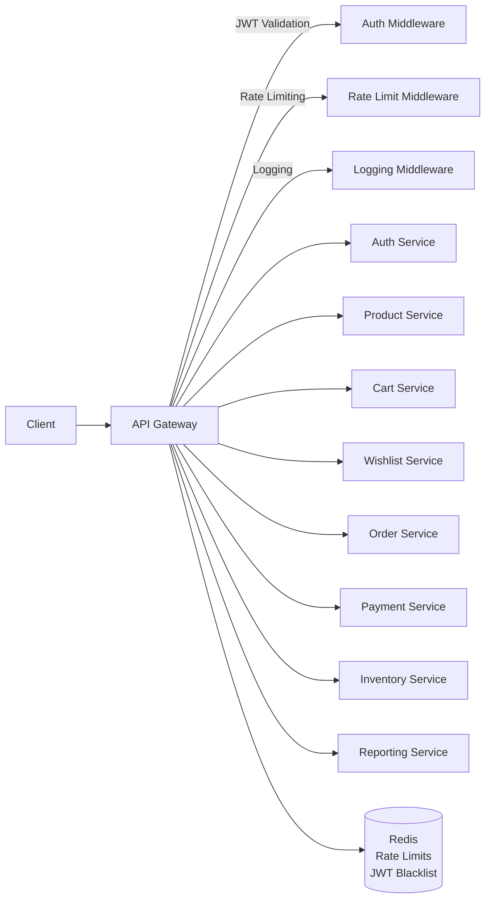

### Components

#### 1. Router
- Route matching and forwarding
- Path-based routing
- Service discovery
- Load balancing

#### 2. Authentication Middleware
- Extract JWT from Authorization header
- Validate JWT signature
- Check JWT expiration
- Verify against blacklist (Redis)
- Extract user context

#### 3. Rate Limiting Middleware
- Token bucket algorithm
- Per-IP rate limiting (100 req/min)
- Per-user rate limiting (1000 req/min)
- Redis-backed counters
- Custom rate limits per endpoint

#### 4. Logging Middleware
- Request ID generation
- Request/response logging
- Duration tracking
- Error logging
- Structured logging (JSON)

#### 5. CORS Middleware
- Configure allowed origins
- Preflight handling
- Credential support

#### 6. Circuit Breaker
- Fail fast on downstream failures
- Automatic recovery
- Fallback responses

### Configuration

```go
type Config struct {
    Port              int
    JWTSecret         string
    RateLimitPerIP    int
    RateLimitPerUser  int
    RedisURL          string
    Services          map[string]string
    Timeout           time.Duration
    CircuitBreaker    CircuitBreakerConfig
}
```

### Routing Rules

| Path Pattern | Target Service | Auth Required |
|--------------|---------------|---------------|
| `/api/v1/auth/**` | Auth Service | No (except /me, /profile) |
| `/api/v1/products/**` | Product Service | No (except admin) |
| `/api/v1/categories/**` | Product Service | No (except admin) |
| `/api/v1/cart/**` | Cart Service | Yes |
| `/api/v1/wishlist/**` | Wishlist Service | Yes |
| `/api/v1/orders/**` | Order Service | Yes |
| `/api/v1/payments/**` | Payment Service | Yes |
| `/api/v1/inventory/**` | Inventory Service | Admin only |
| `/api/v1/reports/**` | Reporting Service | Admin only |

---

## Auth Service

### Overview
Handles user authentication, authorization, JWT management, and user profile operations.

### Architecture Diagram

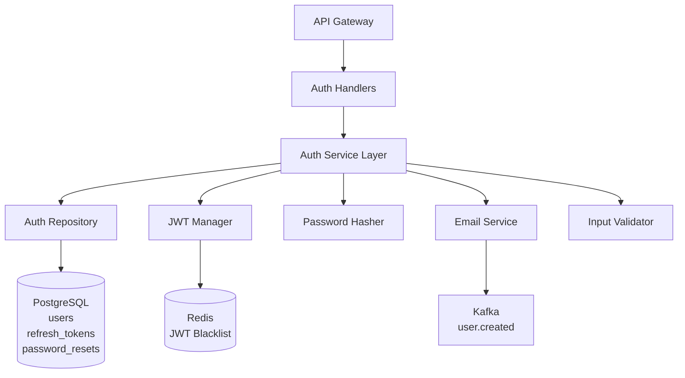

### Components

#### 1. Handlers Layer
- `Register()` - User registration
- `Login()` - User authentication
- `Refresh()` - Token refresh
- `Logout()` - Invalidate tokens
- `ForgotPassword()` - Password reset request
- `ResetPassword()` - Password reset
- `VerifyEmail()` - Email verification
- `GetProfile()` - Get current user
- `UpdateProfile()` - Update user profile

#### 2. Service Layer
Business logic:
- Validate user input
- Check email uniqueness
- Hash passwords (bcrypt, cost 12)
- Generate JWT tokens
- Validate credentials
- Manage refresh tokens
- Send verification emails

#### 3. Repository Layer
Database operations:
- Create user
- Find user by email/ID
- Update user
- Store refresh token
- Revoke refresh token
- Create password reset token
- Validate password reset token

#### 4. JWT Manager
Token operations:
- Generate access token (15 min expiry)
- Generate refresh token (7 days expiry)
- Validate token
- Extract claims
- Blacklist token (on logout)
- Check blacklist

#### 5. Password Hasher
- Hash password (bcrypt)
- Compare password hash
- Validate password strength

### Data Models

```go
type User struct {
    ID            uuid.UUID `gorm:"type:uuid;primaryKey"`
    Email         string    `gorm:"uniqueIndex;not null"`
    PasswordHash  string    `gorm:"not null"`
    FirstName     string
    LastName      string
    Role          UserRole  `gorm:"type:varchar(20);default:'customer'"`
    IsVerified    bool      `gorm:"default:false"`
    CreatedAt     time.Time
    UpdatedAt     time.Time
}

type RefreshToken struct {
    ID        uuid.UUID `gorm:"type:uuid;primaryKey"`
    UserID    uuid.UUID `gorm:"type:uuid;not null"`
    Token     string    `gorm:"uniqueIndex;not null"`
    ExpiresAt time.Time `gorm:"not null"`
    CreatedAt time.Time
}

type PasswordReset struct {
    ID        uuid.UUID `gorm:"type:uuid;primaryKey"`
    UserID    uuid.UUID `gorm:"type:uuid;not null"`
    Token     string    `gorm:"uniqueIndex;not null"`
    ExpiresAt time.Time `gorm:"not null"`
    Used      bool      `gorm:"default:false"`
    CreatedAt time.Time
}
```

### Authentication Flow

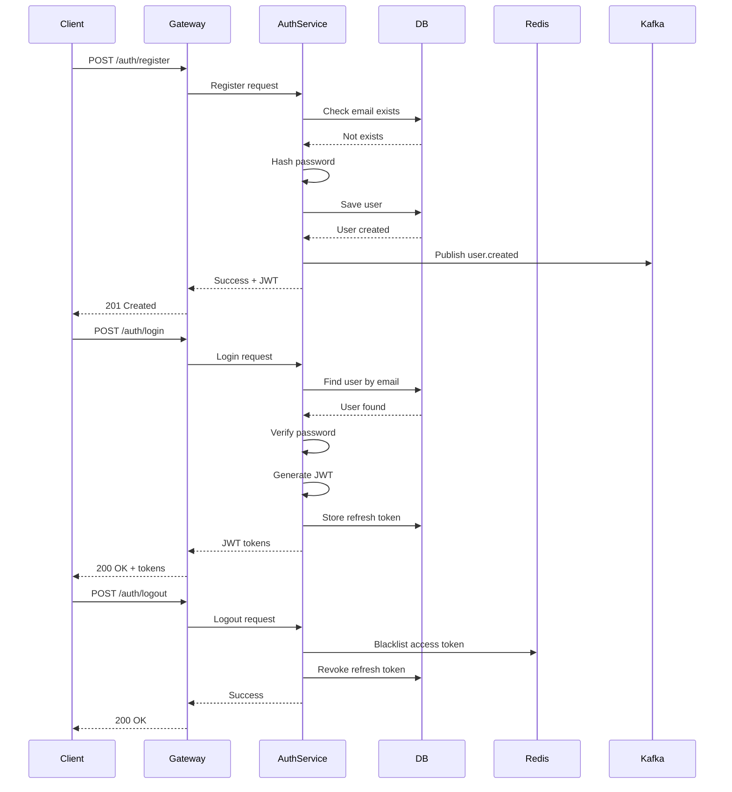

### Security Considerations

1. **Password Storage**: bcrypt with cost factor 12
2. **JWT Secret**: 256-bit random secret, stored in K8s secret
3. **Token Blacklist**: Redis with TTL = token expiry
4. **Rate Limiting**: 5 login attempts per 15 minutes per IP
5. **Email Verification**: Required before full access
6. **Password Reset**: Single-use tokens, 1-hour expiry

---

## Product Service

### Overview
Manages product catalog, categories, reviews, ratings, and search functionality with Redis caching.

### Architecture Diagram

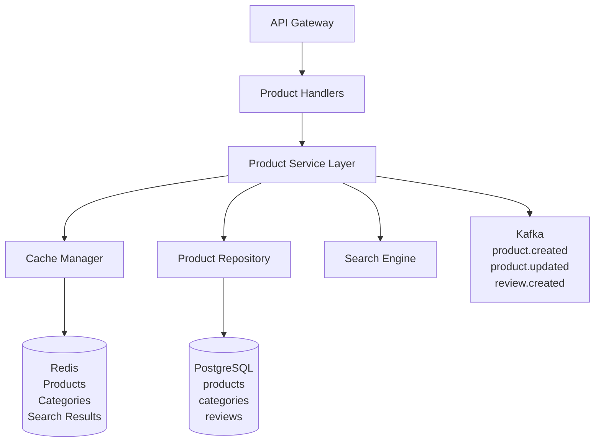

### Components

#### 1. Handlers Layer
- Products: CRUD, list, search, filter
- Categories: CRUD, hierarchical structure
- Reviews: Create, update, delete, list
- Images: Upload, delete

#### 2. Service Layer
Business logic:
- Product validation
- SKU uniqueness
- Category hierarchy
- Review moderation
- Rating calculation
- Stock validation (call Inventory)
- Cache invalidation

#### 3. Cache Manager
Caching strategy:
- **Product Details**: 1 hour TTL, cache-aside
- **Category Tree**: 24 hours TTL, cache-aside
- **Search Results**: 15 minutes TTL, query-based key
- **Product List by Category**: 30 minutes TTL

```go
func (s *Service) GetProduct(id uuid.UUID) (*Product, error) {
    // Check cache
    cacheKey := fmt.Sprintf("product:%s", id)
    cached, err := s.cache.Get(cacheKey)
    if err == nil {
        return cached, nil
    }
    
    // Cache miss - fetch from DB
    product, err := s.repo.FindByID(id)
    if err != nil {
        return nil, err
    }
    
    // Store in cache
    s.cache.Set(cacheKey, product, 1*time.Hour)
    return product, nil
}
```

#### 4. Search Engine
- Full-text search on name, description
- Filters: category, price range, rating, brand
- Sorting: popularity, price, rating, newest
- Pagination: cursor-based for consistency

### Data Models

```go
type Product struct {
    ID            uuid.UUID       `gorm:"type:uuid;primaryKey"`
    Name          string          `gorm:"not null"`
    Description   string
    Price         decimal.Decimal `gorm:"type:decimal(10,2);not null"`
    CategoryID    uuid.UUID       `gorm:"type:uuid"`
    Category      Category
    Brand         string
    SKU           string          `gorm:"uniqueIndex;not null"`
    Images        pq.StringArray  `gorm:"type:text[]"`
    AverageRating decimal.Decimal `gorm:"type:decimal(3,2);default:0"`
    TotalReviews  int             `gorm:"default:0"`
    CreatedAt     time.Time
    UpdatedAt     time.Time
}

type Category struct {
    ID          uuid.UUID `gorm:"type:uuid;primaryKey"`
    Name        string    `gorm:"uniqueIndex;not null"`
    Slug        string    `gorm:"uniqueIndex;not null"`
    ParentID    *uuid.UUID `gorm:"type:uuid"`
    Description string
    CreatedAt   time.Time
    UpdatedAt   time.Time
}

type Review struct {
    ID               uuid.UUID `gorm:"type:uuid;primaryKey"`
    ProductID        uuid.UUID `gorm:"type:uuid;not null"`
    UserID           uuid.UUID `gorm:"type:uuid;not null"`
    Rating           int       `gorm:"check:rating >= 1 AND rating <= 5"`
    Title            string
    Comment          string
    VerifiedPurchase bool      `gorm:"default:false"`
    CreatedAt        time.Time
    UpdatedAt        time.Time
}
```

### Search & Filter Flow

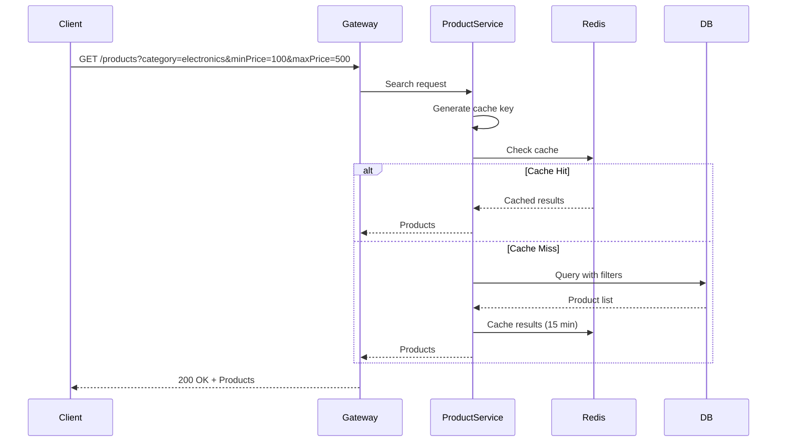

---

## Cart Service

### Overview
Manages shopping cart operations with Redis caching for performance.

### Architecture Diagram

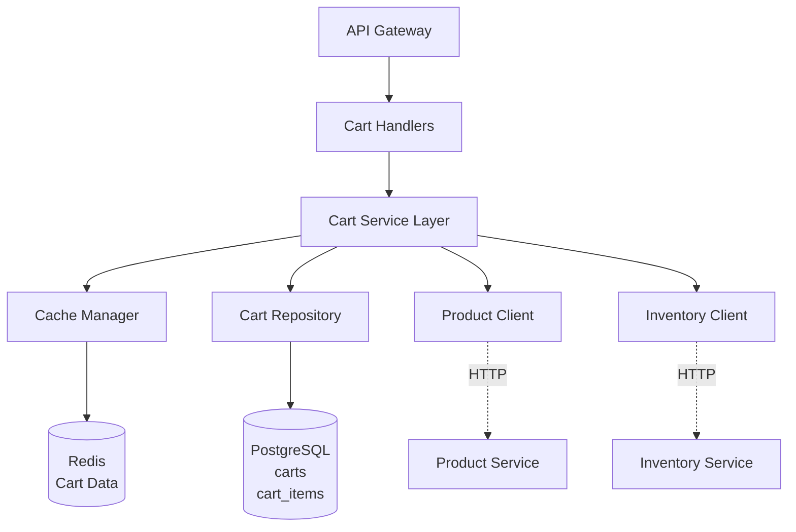

### Components

#### 1. Service Layer
Business logic:
- Add item: Validate product exists, check stock, update quantity if exists
- Update item: Validate quantity, check stock availability
- Remove item: Delete from cart
- Clear cart: Remove all items
- Calculate totals: Fetch current prices, apply discounts
- Validate cart: Check all products exist and in stock

#### 2. Cache Manager
- Cart cached in Redis with user_id as key
- TTL: 24 hours
- Invalidate on any cart operation
- Lazy load from DB if cache miss

#### 3. Service Integrations

**Product Service Integration:**
```go
func (s *Service) AddToCart(userID, productID uuid.UUID, quantity int) error {
    // Validate product exists
    product, err := s.productClient.GetProduct(productID)
    if err != nil {
        return errors.New("product not found")
    }
    
    // Check stock availability
    stock, err := s.inventoryClient.CheckStock(productID)
    if err != nil || stock < quantity {
        return errors.New("insufficient stock")
    }
    
    // Add to cart with current price snapshot
    return s.repo.AddItem(userID, productID, quantity, product.Price)
}
```

### Data Models

```go
type Cart struct {
    ID        uuid.UUID `gorm:"type:uuid;primaryKey"`
    UserID    uuid.UUID `gorm:"type:uuid;uniqueIndex;not null"`
    CreatedAt time.Time
    UpdatedAt time.Time
    ExpiresAt time.Time
}

type CartItem struct {
    ID        uuid.UUID       `gorm:"type:uuid;primaryKey"`
    CartID    uuid.UUID       `gorm:"type:uuid;not null"`
    ProductID uuid.UUID       `gorm:"type:uuid;not null"`
    Quantity  int             `gorm:"not null;check:quantity > 0"`
    Price     decimal.Decimal `gorm:"type:decimal(10,2);not null"` // Price snapshot
    CreatedAt time.Time
    UpdatedAt time.Time
}
```

### Cart Operations Flow

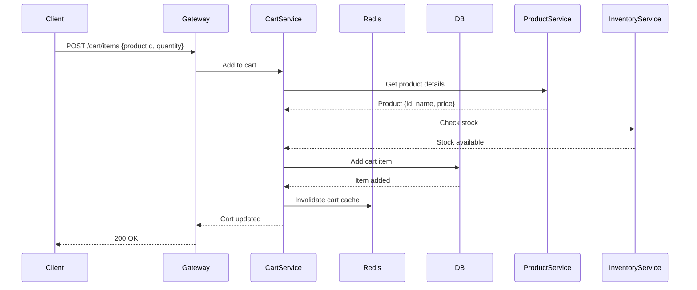

---

## Order Service

### Overview
Manages order lifecycle from creation to delivery with state machine pattern.

### Architecture Diagram

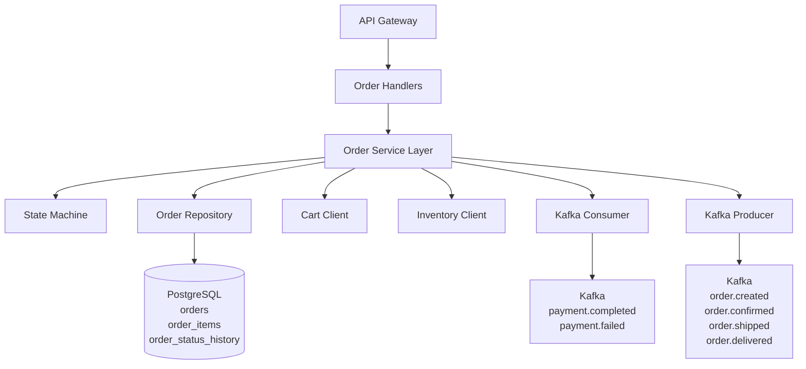

### Order State Machine

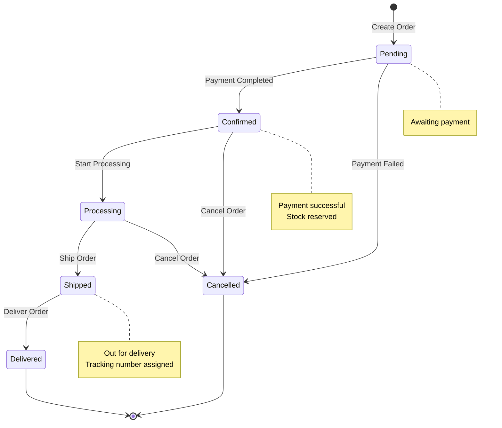

### Components

#### 1. State Machine
Manages order status transitions:
```go
type OrderStateMachine struct {
    transitions map[OrderStatus][]OrderStatus
}

func (sm *OrderStateMachine) CanTransition(from, to OrderStatus) bool {
    allowedTransitions, ok := sm.transitions[from]
    if !ok {
        return false
    }
    for _, allowed := range allowedTransitions {
        if allowed == to {
            return true
        }
    }
    return false
}

// Define transitions
transitions := map[OrderStatus][]OrderStatus{
    StatusPending:    {StatusConfirmed, StatusCancelled},
    StatusConfirmed:  {StatusProcessing, StatusCancelled},
    StatusProcessing: {StatusShipped, StatusCancelled},
    StatusShipped:    {StatusDelivered},
    // Terminal states have no outgoing transitions
    StatusDelivered:  {},
    StatusCancelled:  {},
}
```

#### 2. Service Layer
Business logic:
- **Create Order**: Fetch cart, validate stock, calculate totals, create order, clear cart
- **Confirm Order**: Update status, reserve inventory, send notification
- **Cancel Order**: Release inventory, process refund, update status
- **Track Order**: Get status history, estimated delivery

#### 3. Event Handlers
```go
// Listen for payment events
func (s *Service) HandlePaymentCompleted(event PaymentCompletedEvent) {
    order, _ := s.repo.FindByID(event.OrderID)
    s.ConfirmOrder(order.ID)
    s.producer.Publish("order.confirmed", order)
}

func (s *Service) HandlePaymentFailed(event PaymentFailedEvent) {
    order, _ := s.repo.FindByID(event.OrderID)
    s.CancelOrder(order.ID, "Payment failed")
    s.producer.Publish("order.cancelled", order)
}
```

### Data Models

```go
type Order struct {
    ID              uuid.UUID       `gorm:"type:uuid;primaryKey"`
    UserID          uuid.UUID       `gorm:"type:uuid;not null"`
    OrderNumber     string          `gorm:"uniqueIndex;not null"`
    Status          OrderStatus     `gorm:"type:varchar(20);not null"`
    Subtotal        decimal.Decimal `gorm:"type:decimal(10,2);not null"`
    Tax             decimal.Decimal `gorm:"type:decimal(10,2);not null"`
    ShippingCost    decimal.Decimal `gorm:"type:decimal(10,2);not null"`
    Total           decimal.Decimal `gorm:"type:decimal(10,2);not null"`
    ShippingAddress datatypes.JSON  `gorm:"type:jsonb"`
    BillingAddress  datatypes.JSON  `gorm:"type:jsonb"`
    CreatedAt       time.Time
    UpdatedAt       time.Time
}

type OrderItem struct {
    ID           uuid.UUID       `gorm:"type:uuid;primaryKey"`
    OrderID      uuid.UUID       `gorm:"type:uuid;not null"`
    ProductID    uuid.UUID       `gorm:"type:uuid;not null"`
    ProductName  string          `gorm:"not null"` // Snapshot
    ProductPrice decimal.Decimal `gorm:"type:decimal(10,2);not null"` // Snapshot
    Quantity     int             `gorm:"not null"`
    Subtotal     decimal.Decimal `gorm:"type:decimal(10,2);not null"`
    CreatedAt    time.Time
}

type OrderStatusHistory struct {
    ID        uuid.UUID   `gorm:"type:uuid;primaryKey"`
    OrderID   uuid.UUID   `gorm:"type:uuid;not null"`
    Status    OrderStatus `gorm:"type:varchar(20);not null"`
    Comment   string
    CreatedAt time.Time
}
```

### Order Creation Flow

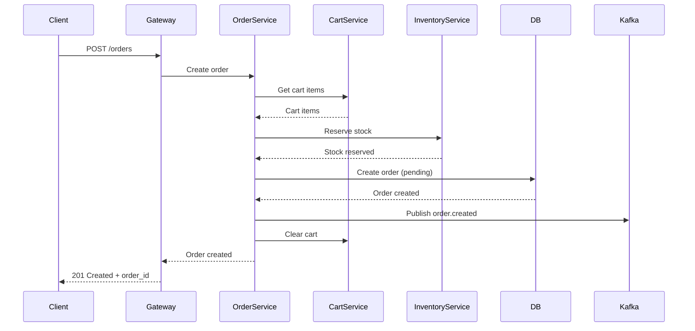

---

## Payment Service

### Overview
Handles payment processing via Stripe with webhook integration.

### Architecture Diagram

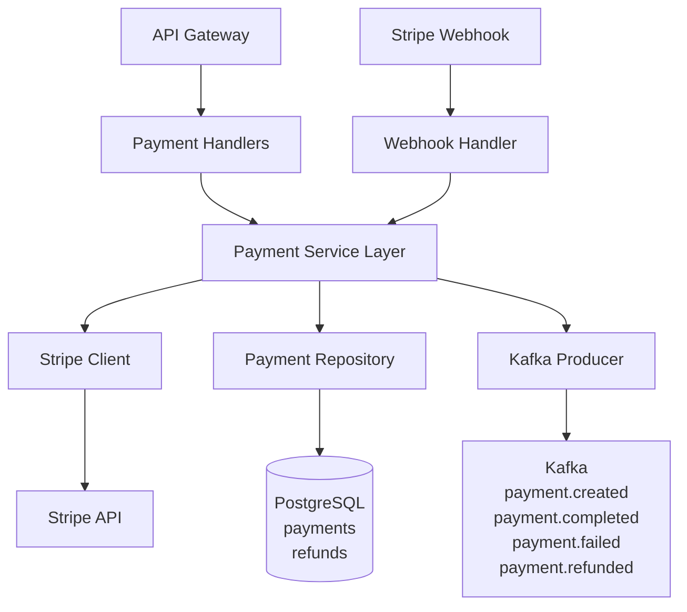

### Components

#### 1. Stripe Integration
```go
type StripeClient struct {
    apiKey string
}

func (c *StripeClient) CreatePaymentIntent(amount int64, currency string, metadata map[string]string) (*stripe.PaymentIntent, error) {
    params := &stripe.PaymentIntentParams{
        Amount:   stripe.Int64(amount),
        Currency: stripe.String(currency),
    }
    for key, value := range metadata {
        params.AddMetadata(key, value)
    }
    return paymentintent.New(params)
}

func (c *StripeClient) ConfirmPayment(paymentIntentID, paymentMethod string) (*stripe.PaymentIntent, error) {
    params := &stripe.PaymentIntentConfirmParams{
        PaymentMethod: stripe.String(paymentMethod),
    }
    return paymentintent.Confirm(paymentIntentID, params)
}
```

#### 2. Webhook Handler
Verify Stripe signature and process events:
```go
func (h *Handler) HandleWebhook(c *gin.Context) {
    payload, _ := ioutil.ReadAll(c.Request.Body)
    signature := c.GetHeader("Stripe-Signature")
    
    // Verify webhook signature
    event, err := webhook.ConstructEvent(payload, signature, webhookSecret)
    if err != nil {
        c.JSON(400, gin.H{"error": "Invalid signature"})
        return
    }
    
    // Handle event
    switch event.Type {
    case "payment_intent.succeeded":
        h.handlePaymentSucceeded(event)
    case "payment_intent.payment_failed":
        h.handlePaymentFailed(event)
    case "charge.refunded":
        h.handleRefunded(event)
    }
    
    c.JSON(200, gin.H{"received": true})
}
```

### Data Models

```go
type Payment struct {
    ID                    uuid.UUID       `gorm:"type:uuid;primaryKey"`
    OrderID               uuid.UUID       `gorm:"type:uuid;uniqueIndex;not null"`
    UserID                uuid.UUID       `gorm:"type:uuid;not null"`
    StripePaymentIntentID string          `gorm:"uniqueIndex"`
    Amount                decimal.Decimal `gorm:"type:decimal(10,2);not null"`
    Currency              string          `gorm:"type:varchar(3);default:'USD'"`
    Status                PaymentStatus   `gorm:"type:varchar(20);not null"`
    PaymentMethod         string
    CreatedAt             time.Time
    UpdatedAt             time.Time
}

type Refund struct {
    ID              uuid.UUID       `gorm:"type:uuid;primaryKey"`
    PaymentID       uuid.UUID       `gorm:"type:uuid;not null"`
    StripeRefundID  string          `gorm:"uniqueIndex"`
    Amount          decimal.Decimal `gorm:"type:decimal(10,2);not null"`
    Reason          string
    Status          RefundStatus    `gorm:"type:varchar(20);not null"`
    CreatedAt       time.Time
}
```

### Payment Flow

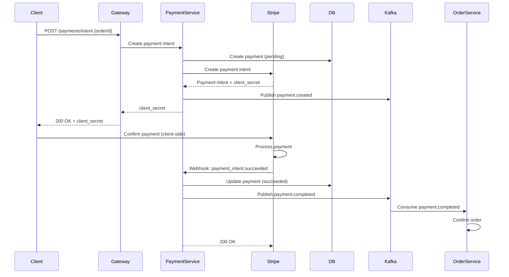

---

## Inventory Service

### Overview
Manages product inventory, stock reservations, and low stock alerts.

### Architecture Diagram

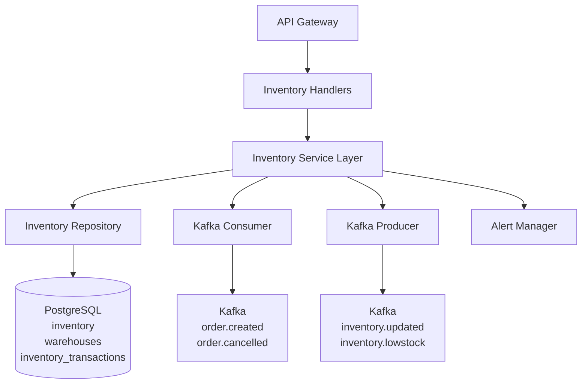

### Components

#### 1. Stock Management
```go
func (s *Service) ReserveStock(productID uuid.UUID, quantity int) error {
    s.mutex.Lock()
    defer s.mutex.Unlock()
    
    inventory, err := s.repo.FindByProductID(productID)
    if err != nil {
        return err
    }
    
    if inventory.QuantityAvailable < quantity {
        return errors.New("insufficient stock")
    }
    
    // Update inventory
    inventory.QuantityAvailable -= quantity
    inventory.QuantityReserved += quantity
    
    if err := s.repo.Update(inventory); err != nil {
        return err
    }
    
    // Record transaction
    s.repo.CreateTransaction(&InventoryTransaction{
        InventoryID:     inventory.ID,
        TransactionType: "reserve",
        Quantity:        quantity,
        PreviousQty:     inventory.QuantityAvailable + quantity,
        NewQty:          inventory.QuantityAvailable,
    })
    
    // Check low stock threshold
    if inventory.QuantityAvailable < inventory.LowStockThreshold {
        s.producer.Publish("inventory.lowstock", inventory)
    }
    
    return nil
}
```

#### 2. Event Handlers
```go
func (s *Service) HandleOrderCreated(event OrderCreatedEvent) {
    for _, item := range event.Items {
        s.ReserveStock(item.ProductID, item.Quantity)
    }
}

func (s *Service) HandleOrderCancelled(event OrderCancelledEvent) {
    for _, item := range event.Items {
        s.ReleaseStock(item.ProductID, item.Quantity)
    }
}
```

### Data Models

```go
type Inventory struct {
    ID                 uuid.UUID       `gorm:"type:uuid;primaryKey"`
    ProductID          uuid.UUID       `gorm:"type:uuid;uniqueIndex;not null"`
    SKU                string          `gorm:"not null"`
    QuantityAvailable  int             `gorm:"not null;default:0"`
    QuantityReserved   int             `gorm:"not null;default:0"`
    QuantitySold       int             `gorm:"not null;default:0"`
    WarehouseID        uuid.UUID       `gorm:"type:uuid"`
    LowStockThreshold  int             `gorm:"default:10"`
    CreatedAt          time.Time
    UpdatedAt          time.Time
}

type Warehouse struct {
    ID        uuid.UUID      `gorm:"type:uuid;primaryKey"`
    Name      string         `gorm:"not null"`
    Code      string         `gorm:"uniqueIndex;not null"`
    Address   datatypes.JSON `gorm:"type:jsonb"`
    IsActive  bool           `gorm:"default:true"`
    CreatedAt time.Time
    UpdatedAt time.Time
}

type InventoryTransaction struct {
    ID              uuid.UUID `gorm:"type:uuid;primaryKey"`
    InventoryID     uuid.UUID `gorm:"type:uuid;not null"`
    TransactionType string    `gorm:"type:varchar(20);not null"` // purchase, sale, adjustment, return
    Quantity        int       `gorm:"not null"`
    PreviousQty     int       `gorm:"not null"`
    NewQty          int       `gorm:"not null"`
    ReferenceID     *uuid.UUID `gorm:"type:uuid"` // order_id, etc.
    Notes           string
    CreatedAt       time.Time
}
```

---

## Notification Service

### Overview
Asynchronous event-driven service that sends email notifications.

### Architecture Diagram

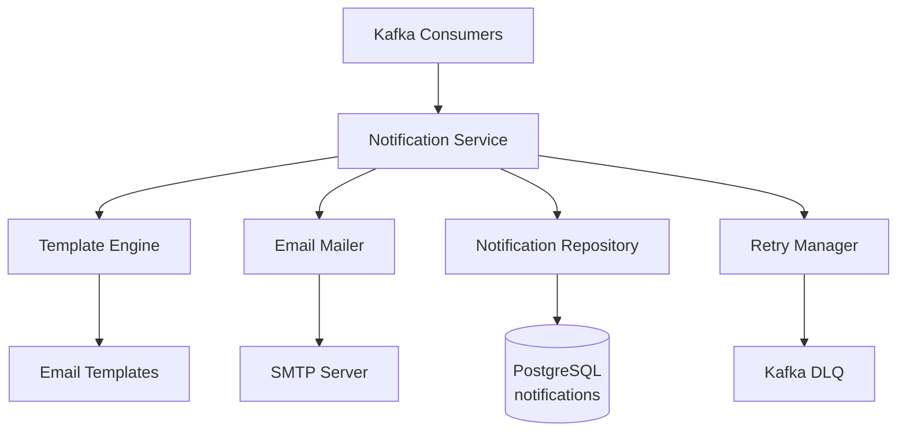

### Components

#### 1. Kafka Consumers
Listen to multiple topics:
- `user.created` → Welcome email
- `order.created` → Order confirmation
- `order.shipped` → Shipping notification
- `order.delivered` → Delivery confirmation
- `payment.completed` → Payment receipt
- `inventory.lowstock` → Low stock alert (admin)

#### 2. Template Engine
HTML email templates with Go templates:
```go
func (t *TemplateEngine) Render(templateName string, data interface{}) (string, error) {
    tmpl, err := template.ParseFiles(fmt.Sprintf("templates/%s.html", templateName))
    if err != nil {
        return "", err
    }
    
    var buf bytes.Buffer
    if err := tmpl.Execute(&buf, data); err != nil {
        return "", err
    }
    
    return buf.String(), nil
}
```

#### 3. Email Mailer
SMTP client with retry logic:
```go
func (m *Mailer) Send(to, subject, body string) error {
    msg := []byte(fmt.Sprintf("To: %s\r\n"+
        "Subject: %s\r\n"+
        "Content-Type: text/html; charset=UTF-8\r\n"+
        "\r\n"+
        "%s\r\n", to, subject, body))
    
    auth := smtp.PlainAuth("", m.username, m.password, m.host)
    return smtp.SendMail(m.host+":"+m.port, auth, m.from, []to, msg)
}
```

#### 4. Retry Manager
Exponential backoff retry:
```go
func (s *Service) SendWithRetry(notification *Notification) {
    maxRetries := 3
    backoff := []time.Duration{1 * time.Minute, 5 * time.Minute, 15 * time.Minute}
    
    for i := 0; i < maxRetries; i++ {
        if err := s.mailer.Send(notification.Recipient, notification.Subject, notification.Body); err == nil {
            notification.Status = "sent"
            notification.SentAt = time.Now()
            s.repo.Update(notification)
            return
        }
        
        notification.RetryCount++
        if i < maxRetries-1 {
            time.Sleep(backoff[i])
        }
    }
    
    // All retries failed
    notification.Status = "failed"
    notification.ErrorMessage = "Max retries exceeded"
    s.repo.Update(notification)
    
    // Send to DLQ
    s.producer.Publish("dlq.notifications", notification)
}
```

### Data Models

```go
type Notification struct {
    ID           uuid.UUID `gorm:"type:uuid;primaryKey"`
    UserID       uuid.UUID `gorm:"type:uuid"`
    Type         string    `gorm:"type:varchar(50);not null"`
    Template     string    `gorm:"not null"`
    Recipient    string    `gorm:"not null"`
    Subject      string    `gorm:"not null"`
    Body         string    `gorm:"type:text"`
    Status       string    `gorm:"type:varchar(20);default:'pending'"`
    RetryCount   int       `gorm:"default:0"`
    ErrorMessage string
    SentAt       *time.Time
    CreatedAt    time.Time
}
```

---

## Reporting Service

### Overview
Provides analytics, dashboards, and export capabilities.

### Architecture Diagram

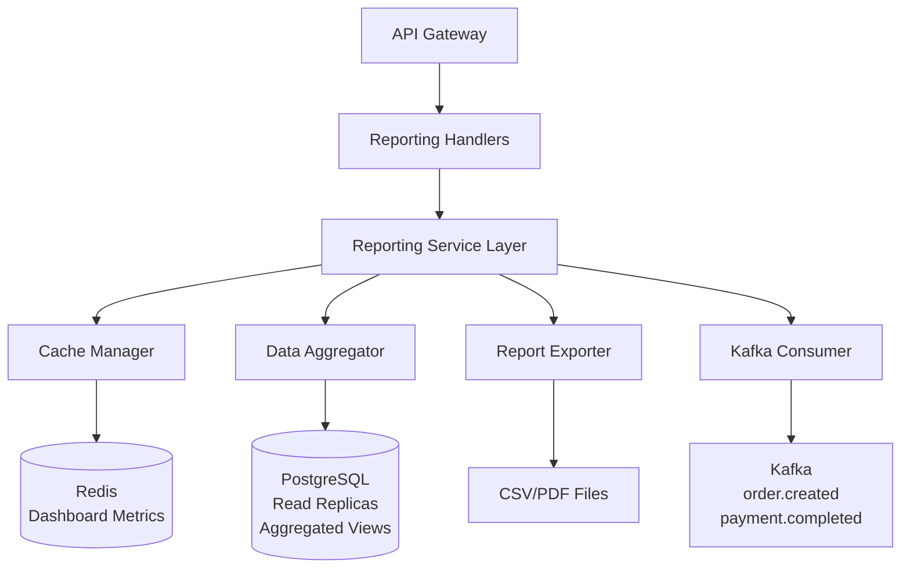

### Components

#### 1. Data Aggregator
Background jobs for pre-aggregation:
```go
func (s *Service) AggregateDaily() {
    // Run at midnight
    date := time.Now().AddDate(0, 0, -1).Format("2006-01-02")
    
    // Aggregate revenue
    var totalRevenue decimal.Decimal
    s.db.Table("payments").
        Where("status = ? AND DATE(created_at) = ?", "succeeded", date).
        Select("COALESCE(SUM(amount), 0)").
        Scan(&totalRevenue)
    
    // Aggregate orders
    var orderCount int64
    s.db.Table("orders").
        Where("DATE(created_at) = ?", date).
        Count(&orderCount)
    
    // Store in materialized view or cache
    metrics := DailyMetrics{
        Date:     date,
        Revenue:  totalRevenue,
        Orders:   orderCount,
    }
    s.cache.Set(fmt.Sprintf("daily:%s", date), metrics, 24*time.Hour)
}
```

#### 2. Dashboard Metrics
Real-time metrics with caching:
```go
func (s *Service) GetDashboardMetrics() (*DashboardMetrics, error) {
    cacheKey := "dashboard:metrics"
    
    // Check cache
    cached, err := s.cache.Get(cacheKey)
    if err == nil {
        return cached, nil
    }
    
    // Aggregate from database
    metrics := &DashboardMetrics{
        TotalRevenue:   s.getTotalRevenue(),
        TodayRevenue:   s.getTodayRevenue(),
        TotalOrders:    s.getTotalOrders(),
        PendingOrders:  s.getPendingOrders(),
        TotalCustomers: s.getTotalCustomers(),
        NewCustomers:   s.getNewCustomers(24 * time.Hour),
    }
    
    // Cache for 5 minutes
    s.cache.Set(cacheKey, metrics, 5*time.Minute)
    return metrics, nil
}
```

#### 3. Report Exporter
CSV and PDF generation:
```go
func (e *Exporter) ExportCSV(reportType string, data interface{}) (string, error) {
    filename := fmt.Sprintf("%s_%s.csv", reportType, time.Now().Format("20060102"))
    file, _ := os.Create(filename)
    defer file.Close()
    
    writer := csv.NewWriter(file)
    defer writer.Flush()
    
    // Write data to CSV
    // ...
    
    return filename, nil
}
```

### Dashboard Metrics Model

```go
type DashboardMetrics struct {
    // Revenue
    TotalRevenue   decimal.Decimal
    TodayRevenue   decimal.Decimal
    WeeklyRevenue  decimal.Decimal
    MonthlyRevenue decimal.Decimal
    
    // Orders
    TotalOrders    int64
    PendingOrders  int64
    ShippedOrders  int64
    DeliveredOrders int64
    
    // Products
    TotalProducts  int64
    LowStockCount  int64
    BestSellers    []ProductMetric
    
    // Customers
    TotalCustomers int64
    NewCustomers   int64
    ActiveCustomers int64
    
    // Charts
    RevenueChart   []ChartDataPoint
    OrderChart     []ChartDataPoint
}

type ChartDataPoint struct {
    Date  string
    Value float64
}
```

---

## Cross-Cutting Concerns

### Logging
Structured logging with correlation IDs:
```go
logger.Info("Order created",
    zap.String("request_id", requestID),
    zap.String("order_id", orderID),
    zap.String("user_id", userID),
    zap.Duration("duration", duration))
```

### Error Handling
Standardized error responses:
```go
type ErrorResponse struct {
    Status  int    `json:"status"`
    Message string `json:"message"`
    Code    string `json:"code"`
    Details map[string]interface{} `json:"details,omitempty"`
}
```

### Metrics
Prometheus metrics:
```go
requestDuration := prometheus.NewHistogramVec(
    prometheus.HistogramOpts{
        Name: "http_request_duration_seconds",
        Help: "HTTP request duration in seconds",
    },
    []string{"service", "method", "endpoint", "status"},
)
```

### Distributed Tracing
OpenTelemetry spans:
```go
ctx, span := tracer.Start(ctx, "OrderService.CreateOrder")
defer span.End()

span.SetAttributes(
    attribute.String("order.id", orderID),
    attribute.String("user.id", userID),
)
```

---

## Service Communication Patterns

### Request-Response (Synchronous)
- API Gateway ↔ All Services (REST)
- Cart Service → Product Service (HTTP)
- Cart Service → Inventory Service (HTTP)
- Order Service → Cart Service (HTTP)

### Event-Driven (Asynchronous)
- All Services → Kafka (Producers)
- Notification, Inventory, Order, Reporting ← Kafka (Consumers)

### Caching
- Product, Cart, Reporting Services → Redis

---

This detailed service architecture provides the foundation for implementing each microservice with proper separation of concerns, scalability, and maintainability.
