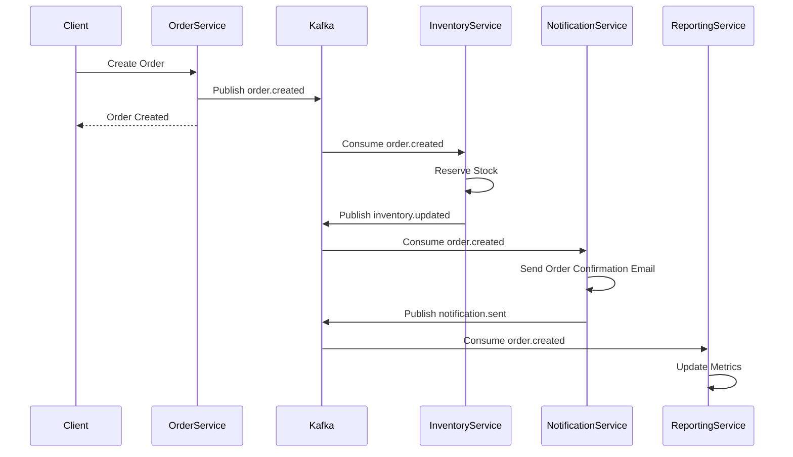
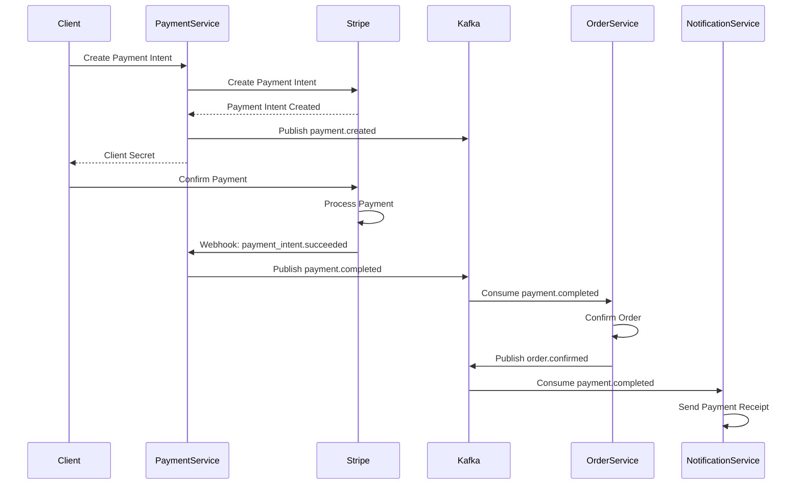

# Kafka Event Contracts

Complete event schemas and messaging patterns for the E-Commerce Platform event-driven architecture.

## Table of Contents
1. [Event Structure](#event-structure)
2. [Topics Configuration](#topics-configuration)
3. [User Events](#user-events)
4. [Product Events](#product-events)
5. [Inventory Events](#inventory-events)
6. [Order Events](#order-events)
7. [Payment Events](#payment-events)
8. [Notification Events](#notification-events)
9. [Dead Letter Queue](#dead-letter-queue)
10. [Event Flow Diagrams](#event-flow-diagrams)
11. [Implementation Examples](#implementation-examples)

---

## Event Structure

All events follow a standardized structure:

```json
{
  "eventId": "uuid",
  "eventType": "string",
  "timestamp": "ISO 8601 datetime",
  "version": "string",
  "source": "string",
  "correlationId": "uuid",
  "payload": {}
}
```

### Field Descriptions

| Field | Type | Description |
|-------|------|-------------|
| eventId | UUID | Unique event identifier |
| eventType | String | Type of event (e.g., "user.created") |
| timestamp | DateTime | Event creation timestamp (ISO 8601) |
| version | String | Event schema version (e.g., "1.0") |
| source | String | Service that produced the event |
| correlationId | UUID | Correlation ID for tracing related events |
| payload | Object | Event-specific data |

---

## Topics Configuration

### Topic List

| Topic | Partitions | Replication Factor | Retention | Description |
|-------|-----------|-------------------|-----------|-------------|
| `user.created` | 3 | 2 | 7 days | User registration events |
| `user.updated` | 3 | 2 | 7 days | User profile updates |
| `user.deleted` | 3 | 2 | 7 days | User deletion events |
| `product.created` | 3 | 2 | 7 days | New product events |
| `product.updated` | 3 | 2 | 7 days | Product update events |
| `product.deleted` | 3 | 2 | 7 days | Product deletion events |
| `review.created` | 3 | 2 | 7 days | New review events |
| `inventory.updated` | 3 | 2 | 7 days | Inventory changes |
| `inventory.lowstock` | 3 | 2 | 7 days | Low stock alerts |
| `inventory.outofstock` | 3 | 2 | 7 days | Out of stock alerts |
| `order.created` | 3 | 2 | 30 days | New order events |
| `order.confirmed` | 3 | 2 | 30 days | Order confirmation |
| `order.shipped` | 3 | 2 | 30 days | Order shipped |
| `order.delivered` | 3 | 2 | 30 days | Order delivered |
| `order.cancelled` | 3 | 2 | 30 days | Order cancellation |
| `payment.created` | 3 | 2 | 30 days | Payment intent created |
| `payment.completed` | 3 | 2 | 30 days | Payment successful |
| `payment.failed` | 3 | 2 | 30 days | Payment failure |
| `payment.refunded` | 3 | 2 | 30 days | Refund processed |
| `notification.send` | 3 | 2 | 7 days | Notification request |
| `notification.sent` | 3 | 2 | 7 days | Notification delivered |
| `notification.failed` | 3 | 2 | 7 days | Notification failure |
| `dlq.notifications` | 3 | 2 | 30 days | Failed notification events |
| `dlq.inventory` | 3 | 2 | 30 days | Failed inventory events |
| `dlq.orders` | 3 | 2 | 30 days | Failed order events |

### Consumer Groups

| Consumer Group | Topics | Service |
|---------------|--------|---------|
| `notification-service-group` | All event topics | Notification Service |
| `inventory-service-group` | `order.*`, `product.*` | Inventory Service |
| `reporting-service-group` | `order.*`, `payment.*`, `user.*`, `product.*` | Reporting Service |
| `order-service-group` | `payment.*` | Order Service |

---

## User Events

### user.created

**Producer:** Auth Service  
**Consumers:** Notification Service, Reporting Service

**Trigger:** New user registration

**Schema:**
```json
{
  "eventId": "550e8400-e29b-41d4-a716-446655440001",
  "eventType": "user.created",
  "timestamp": "2026-06-12T10:30:00Z",
  "version": "1.0",
  "source": "auth-service",
  "correlationId": "550e8400-e29b-41d4-a716-446655440002",
  "payload": {
    "userId": "550e8400-e29b-41d4-a716-446655440000",
    "email": "user@example.com",
    "firstName": "John",
    "lastName": "Doe",
    "role": "customer",
    "isVerified": false,
    "createdAt": "2026-06-12T10:30:00Z"
  }
}
```

**Consumer Actions:**
- **Notification Service:** Send welcome email
- **Reporting Service:** Increment new customers count

---

### user.updated

**Producer:** Auth Service  
**Consumers:** Reporting Service

**Trigger:** User profile update

**Schema:**
```json
{
  "eventId": "550e8400-e29b-41d4-a716-446655440003",
  "eventType": "user.updated",
  "timestamp": "2026-06-12T11:00:00Z",
  "version": "1.0",
  "source": "auth-service",
  "correlationId": "550e8400-e29b-41d4-a716-446655440004",
  "payload": {
    "userId": "550e8400-e29b-41d4-a716-446655440000",
    "changes": {
      "firstName": "Jane",
      "lastName": "Smith"
    },
    "updatedAt": "2026-06-12T11:00:00Z"
  }
}
```

---

### user.deleted

**Producer:** Auth Service  
**Consumers:** Reporting Service

**Trigger:** User account deletion

**Schema:**
```json
{
  "eventId": "550e8400-e29b-41d4-a716-446655440005",
  "eventType": "user.deleted",
  "timestamp": "2026-06-12T12:00:00Z",
  "version": "1.0",
  "source": "auth-service",
  "correlationId": "550e8400-e29b-41d4-a716-446655440006",
  "payload": {
    "userId": "550e8400-e29b-41d4-a716-446655440000",
    "email": "user@example.com",
    "deletedAt": "2026-06-12T12:00:00Z"
  }
}
```

---

## Product Events

### product.created

**Producer:** Product Service  
**Consumers:** Inventory Service, Reporting Service

**Trigger:** New product creation

**Schema:**
```json
{
  "eventId": "550e8400-e29b-41d4-a716-446655440010",
  "eventType": "product.created",
  "timestamp": "2026-06-12T10:30:00Z",
  "version": "1.0",
  "source": "product-service",
  "correlationId": "550e8400-e29b-41d4-a716-446655440011",
  "payload": {
    "productId": "550e8400-e29b-41d4-a716-446655440100",
    "name": "Laptop",
    "description": "High-performance laptop",
    "price": 999.99,
    "categoryId": "550e8400-e29b-41d4-a716-446655440200",
    "categoryName": "Electronics",
    "brand": "TechBrand",
    "sku": "LAPTOP-001",
    "images": [
      "https://cdn.example.com/laptop-1.jpg"
    ],
    "createdAt": "2026-06-12T10:30:00Z"
  }
}
```

**Consumer Actions:**
- **Inventory Service:** Initialize inventory record with zero stock
- **Reporting Service:** Update product count metrics

---

### product.updated

**Producer:** Product Service  
**Consumers:** Reporting Service

**Trigger:** Product details update

**Schema:**
```json
{
  "eventId": "550e8400-e29b-41d4-a716-446655440012",
  "eventType": "product.updated",
  "timestamp": "2026-06-12T11:00:00Z",
  "version": "1.0",
  "source": "product-service",
  "correlationId": "550e8400-e29b-41d4-a716-446655440013",
  "payload": {
    "productId": "550e8400-e29b-41d4-a716-446655440100",
    "changes": {
      "price": 899.99,
      "description": "Updated description"
    },
    "updatedAt": "2026-06-12T11:00:00Z"
  }
}
```

---

### review.created

**Producer:** Product Service  
**Consumers:** Notification Service, Reporting Service

**Trigger:** New product review

**Schema:**
```json
{
  "eventId": "550e8400-e29b-41d4-a716-446655440014",
  "eventType": "review.created",
  "timestamp": "2026-06-12T14:20:00Z",
  "version": "1.0",
  "source": "product-service",
  "correlationId": "550e8400-e29b-41d4-a716-446655440015",
  "payload": {
    "reviewId": "550e8400-e29b-41d4-a716-446655440300",
    "productId": "550e8400-e29b-41d4-a716-446655440100",
    "productName": "Laptop",
    "userId": "550e8400-e29b-41d4-a716-446655440000",
    "rating": 5,
    "title": "Excellent product!",
    "comment": "Very satisfied with this purchase",
    "verifiedPurchase": true,
    "createdAt": "2026-06-12T14:20:00Z"
  }
}
```

---

## Inventory Events

### inventory.updated

**Producer:** Inventory Service  
**Consumers:** Product Service (cache invalidation), Reporting Service

**Trigger:** Stock level change

**Schema:**
```json
{
  "eventId": "550e8400-e29b-41d4-a716-446655440020",
  "eventType": "inventory.updated",
  "timestamp": "2026-06-12T10:30:00Z",
  "version": "1.0",
  "source": "inventory-service",
  "correlationId": "550e8400-e29b-41d4-a716-446655440021",
  "payload": {
    "inventoryId": "550e8400-e29b-41d4-a716-446655440400",
    "productId": "550e8400-e29b-41d4-a716-446655440100",
    "sku": "LAPTOP-001",
    "transactionType": "sale",
    "previousQuantityAvailable": 100,
    "newQuantityAvailable": 98,
    "quantityChanged": -2,
    "quantityReserved": 5,
    "quantitySold": 452,
    "warehouseId": "550e8400-e29b-41d4-a716-446655440500",
    "referenceId": "550e8400-e29b-41d4-a716-446655440600",
    "updatedAt": "2026-06-12T10:30:00Z"
  }
}
```

---

### inventory.lowstock

**Producer:** Inventory Service  
**Consumers:** Notification Service

**Trigger:** Stock falls below threshold

**Schema:**
```json
{
  "eventId": "550e8400-e29b-41d4-a716-446655440022",
  "eventType": "inventory.lowstock",
  "timestamp": "2026-06-12T10:30:00Z",
  "version": "1.0",
  "source": "inventory-service",
  "correlationId": "550e8400-e29b-41d4-a716-446655440023",
  "payload": {
    "inventoryId": "550e8400-e29b-41d4-a716-446655440400",
    "productId": "550e8400-e29b-41d4-a716-446655440100",
    "productName": "Laptop",
    "sku": "LAPTOP-001",
    "quantityAvailable": 8,
    "lowStockThreshold": 10,
    "warehouseId": "550e8400-e29b-41d4-a716-446655440500",
    "warehouseName": "Main Warehouse",
    "alertedAt": "2026-06-12T10:30:00Z"
  }
}
```

**Consumer Actions:**
- **Notification Service:** Send low stock alert email to admin

---

### inventory.outofstock

**Producer:** Inventory Service  
**Consumers:** Notification Service, Product Service

**Trigger:** Stock reaches zero

**Schema:**
```json
{
  "eventId": "550e8400-e29b-41d4-a716-446655440024",
  "eventType": "inventory.outofstock",
  "timestamp": "2026-06-12T15:45:00Z",
  "version": "1.0",
  "source": "inventory-service",
  "correlationId": "550e8400-e29b-41d4-a716-446655440025",
  "payload": {
    "inventoryId": "550e8400-e29b-41d4-a716-446655440400",
    "productId": "550e8400-e29b-41d4-a716-446655440100",
    "productName": "Laptop",
    "sku": "LAPTOP-001",
    "warehouseId": "550e8400-e29b-41d4-a716-446655440500",
    "alertedAt": "2026-06-12T15:45:00Z"
  }
}
```

---

## Order Events

### order.created

**Producer:** Order Service  
**Consumers:** Inventory Service, Notification Service, Reporting Service

**Trigger:** New order creation

**Schema:**
```json
{
  "eventId": "550e8400-e29b-41d4-a716-446655440030",
  "eventType": "order.created",
  "timestamp": "2026-06-12T10:30:00Z",
  "version": "1.0",
  "source": "order-service",
  "correlationId": "550e8400-e29b-41d4-a716-446655440031",
  "payload": {
    "orderId": "550e8400-e29b-41d4-a716-446655440700",
    "orderNumber": "ORD-2026-001234",
    "userId": "550e8400-e29b-41d4-a716-446655440000",
    "userEmail": "user@example.com",
    "status": "pending",
    "items": [
      {
        "orderItemId": "550e8400-e29b-41d4-a716-446655440701",
        "productId": "550e8400-e29b-41d4-a716-446655440100",
        "productName": "Laptop",
        "productPrice": 999.99,
        "quantity": 2,
        "subtotal": 1999.98
      }
    ],
    "subtotal": 1999.98,
    "tax": 199.99,
    "shippingCost": 10.00,
    "total": 2209.97,
    "shippingAddress": {
      "firstName": "John",
      "lastName": "Doe",
      "addressLine1": "123 Main St",
      "city": "New York",
      "state": "NY",
      "zipCode": "10001",
      "country": "US"
    },
    "createdAt": "2026-06-12T10:30:00Z"
  }
}
```

**Consumer Actions:**
- **Inventory Service:** Reserve stock for order items
- **Notification Service:** Send order confirmation email
- **Reporting Service:** Update order metrics

---

### order.confirmed

**Producer:** Order Service  
**Consumers:** Inventory Service, Notification Service, Reporting Service

**Trigger:** Payment completed

**Schema:**
```json
{
  "eventId": "550e8400-e29b-41d4-a716-446655440032",
  "eventType": "order.confirmed",
  "timestamp": "2026-06-12T10:35:00Z",
  "version": "1.0",
  "source": "order-service",
  "correlationId": "550e8400-e29b-41d4-a716-446655440031",
  "payload": {
    "orderId": "550e8400-e29b-41d4-a716-446655440700",
    "orderNumber": "ORD-2026-001234",
    "userId": "550e8400-e29b-41d4-a716-446655440000",
    "userEmail": "user@example.com",
    "status": "confirmed",
    "total": 2209.97,
    "confirmedAt": "2026-06-12T10:35:00Z"
  }
}
```

**Consumer Actions:**
- **Inventory Service:** Confirm stock reservation (move from reserved to sold)
- **Notification Service:** Send payment confirmation email
- **Reporting Service:** Update confirmed order metrics

---

### order.shipped

**Producer:** Order Service  
**Consumers:** Notification Service, Reporting Service

**Trigger:** Order shipped

**Schema:**
```json
{
  "eventId": "550e8400-e29b-41d4-a716-446655440033",
  "eventType": "order.shipped",
  "timestamp": "2026-06-13T09:00:00Z",
  "version": "1.0",
  "source": "order-service",
  "correlationId": "550e8400-e29b-41d4-a716-446655440031",
  "payload": {
    "orderId": "550e8400-e29b-41d4-a716-446655440700",
    "orderNumber": "ORD-2026-001234",
    "userId": "550e8400-e29b-41d4-a716-446655440000",
    "userEmail": "user@example.com",
    "status": "shipped",
    "trackingNumber": "1Z999AA1012345678",
    "carrier": "UPS",
    "estimatedDelivery": "2026-06-15T17:00:00Z",
    "shippedAt": "2026-06-13T09:00:00Z"
  }
}
```

**Consumer Actions:**
- **Notification Service:** Send shipping notification email with tracking info

---

### order.delivered

**Producer:** Order Service  
**Consumers:** Notification Service, Reporting Service

**Trigger:** Order delivery confirmed

**Schema:**
```json
{
  "eventId": "550e8400-e29b-41d4-a716-446655440034",
  "eventType": "order.delivered",
  "timestamp": "2026-06-15T14:30:00Z",
  "version": "1.0",
  "source": "order-service",
  "correlationId": "550e8400-e29b-41d4-a716-446655440031",
  "payload": {
    "orderId": "550e8400-e29b-41d4-a716-446655440700",
    "orderNumber": "ORD-2026-001234",
    "userId": "550e8400-e29b-41d4-a716-446655440000",
    "userEmail": "user@example.com",
    "status": "delivered",
    "deliveredAt": "2026-06-15T14:30:00Z"
  }
}
```

**Consumer Actions:**
- **Notification Service:** Send delivery confirmation email, request review

---

### order.cancelled

**Producer:** Order Service  
**Consumers:** Inventory Service, Notification Service, Reporting Service

**Trigger:** Order cancellation

**Schema:**
```json
{
  "eventId": "550e8400-e29b-41d4-a716-446655440035",
  "eventType": "order.cancelled",
  "timestamp": "2026-06-12T11:00:00Z",
  "version": "1.0",
  "source": "order-service",
  "correlationId": "550e8400-e29b-41d4-a716-446655440031",
  "payload": {
    "orderId": "550e8400-e29b-41d4-a716-446655440700",
    "orderNumber": "ORD-2026-001234",
    "userId": "550e8400-e29b-41d4-a716-446655440000",
    "userEmail": "user@example.com",
    "status": "cancelled",
    "reason": "Customer request",
    "items": [
      {
        "productId": "550e8400-e29b-41d4-a716-446655440100",
        "quantity": 2
      }
    ],
    "cancelledAt": "2026-06-12T11:00:00Z"
  }
}
```

**Consumer Actions:**
- **Inventory Service:** Release reserved stock
- **Notification Service:** Send cancellation confirmation email

---

## Payment Events

### payment.created

**Producer:** Payment Service  
**Consumers:** Reporting Service

**Trigger:** Payment intent created

**Schema:**
```json
{
  "eventId": "550e8400-e29b-41d4-a716-446655440040",
  "eventType": "payment.created",
  "timestamp": "2026-06-12T10:30:00Z",
  "version": "1.0",
  "source": "payment-service",
  "correlationId": "550e8400-e29b-41d4-a716-446655440031",
  "payload": {
    "paymentId": "550e8400-e29b-41d4-a716-446655440800",
    "orderId": "550e8400-e29b-41d4-a716-446655440700",
    "orderNumber": "ORD-2026-001234",
    "userId": "550e8400-e29b-41d4-a716-446655440000",
    "amount": 2209.97,
    "currency": "USD",
    "status": "pending",
    "stripePaymentIntentId": "pi_xxx_xxx_xxx",
    "createdAt": "2026-06-12T10:30:00Z"
  }
}
```

---

### payment.completed

**Producer:** Payment Service  
**Consumers:** Order Service, Notification Service, Reporting Service

**Trigger:** Payment successful (Stripe webhook)

**Schema:**
```json
{
  "eventId": "550e8400-e29b-41d4-a716-446655440041",
  "eventType": "payment.completed",
  "timestamp": "2026-06-12T10:35:00Z",
  "version": "1.0",
  "source": "payment-service",
  "correlationId": "550e8400-e29b-41d4-a716-446655440031",
  "payload": {
    "paymentId": "550e8400-e29b-41d4-a716-446655440800",
    "orderId": "550e8400-e29b-41d4-a716-446655440700",
    "orderNumber": "ORD-2026-001234",
    "userId": "550e8400-e29b-41d4-a716-446655440000",
    "userEmail": "user@example.com",
    "amount": 2209.97,
    "currency": "USD",
    "status": "succeeded",
    "paymentMethod": "card",
    "stripePaymentIntentId": "pi_xxx_xxx_xxx",
    "completedAt": "2026-06-12T10:35:00Z"
  }
}
```

**Consumer Actions:**
- **Order Service:** Confirm order, update status to confirmed
- **Notification Service:** Send payment receipt email
- **Reporting Service:** Update revenue metrics

---

### payment.failed

**Producer:** Payment Service  
**Consumers:** Order Service, Notification Service

**Trigger:** Payment failure (Stripe webhook)

**Schema:**
```json
{
  "eventId": "550e8400-e29b-41d4-a716-446655440042",
  "eventType": "payment.failed",
  "timestamp": "2026-06-12T10:35:00Z",
  "version": "1.0",
  "source": "payment-service",
  "correlationId": "550e8400-e29b-41d4-a716-446655440031",
  "payload": {
    "paymentId": "550e8400-e29b-41d4-a716-446655440800",
    "orderId": "550e8400-e29b-41d4-a716-446655440700",
    "orderNumber": "ORD-2026-001234",
    "userId": "550e8400-e29b-41d4-a716-446655440000",
    "userEmail": "user@example.com",
    "amount": 2209.97,
    "currency": "USD",
    "status": "failed",
    "errorCode": "card_declined",
    "errorMessage": "Your card was declined",
    "failedAt": "2026-06-12T10:35:00Z"
  }
}
```

**Consumer Actions:**
- **Order Service:** Cancel order
- **Notification Service:** Send payment failure notification

---

### payment.refunded

**Producer:** Payment Service  
**Consumers:** Order Service, Notification Service, Reporting Service

**Trigger:** Refund processed

**Schema:**
```json
{
  "eventId": "550e8400-e29b-41d4-a716-446655440043",
  "eventType": "payment.refunded",
  "timestamp": "2026-06-12T16:00:00Z",
  "version": "1.0",
  "source": "payment-service",
  "correlationId": "550e8400-e29b-41d4-a716-446655440031",
  "payload": {
    "refundId": "550e8400-e29b-41d4-a716-446655440801",
    "paymentId": "550e8400-e29b-41d4-a716-446655440800",
    "orderId": "550e8400-e29b-41d4-a716-446655440700",
    "orderNumber": "ORD-2026-001234",
    "userId": "550e8400-e29b-41d4-a716-446655440000",
    "userEmail": "user@example.com",
    "amount": 2209.97,
    "reason": "Customer request",
    "status": "succeeded",
    "stripeRefundId": "re_xxx_xxx_xxx",
    "refundedAt": "2026-06-12T16:00:00Z"
  }
}
```

**Consumer Actions:**
- **Notification Service:** Send refund confirmation email
- **Reporting Service:** Update refund metrics

---

## Notification Events

### notification.send

**Producer:** Any Service  
**Consumers:** Notification Service

**Trigger:** Request to send notification

**Schema:**
```json
{
  "eventId": "550e8400-e29b-41d4-a716-446655440050",
  "eventType": "notification.send",
  "timestamp": "2026-06-12T10:30:00Z",
  "version": "1.0",
  "source": "auth-service",
  "correlationId": "550e8400-e29b-41d4-a716-446655440051",
  "payload": {
    "userId": "550e8400-e29b-41d4-a716-446655440000",
    "recipient": "user@example.com",
    "type": "email",
    "template": "welcome-email",
    "data": {
      "firstName": "John",
      "verificationLink": "https://example.com/verify?token=xxx"
    },
    "priority": "normal"
  }
}
```

---

### notification.sent

**Producer:** Notification Service  
**Consumers:** Reporting Service

**Trigger:** Notification successfully delivered

**Schema:**
```json
{
  "eventId": "550e8400-e29b-41d4-a716-446655440052",
  "eventType": "notification.sent",
  "timestamp": "2026-06-12T10:31:00Z",
  "version": "1.0",
  "source": "notification-service",
  "correlationId": "550e8400-e29b-41d4-a716-446655440051",
  "payload": {
    "notificationId": "550e8400-e29b-41d4-a716-446655440900",
    "userId": "550e8400-e29b-41d4-a716-446655440000",
    "recipient": "user@example.com",
    "type": "email",
    "template": "welcome-email",
    "status": "sent",
    "sentAt": "2026-06-12T10:31:00Z"
  }
}
```

---

### notification.failed

**Producer:** Notification Service  
**Consumers:** Reporting Service

**Trigger:** Notification delivery failed

**Schema:**
```json
{
  "eventId": "550e8400-e29b-41d4-a716-446655440053",
  "eventType": "notification.failed",
  "timestamp": "2026-06-12T10:31:00Z",
  "version": "1.0",
  "source": "notification-service",
  "correlationId": "550e8400-e29b-41d4-a716-446655440051",
  "payload": {
    "notificationId": "550e8400-e29b-41d4-a716-446655440900",
    "userId": "550e8400-e29b-41d4-a716-446655440000",
    "recipient": "user@example.com",
    "type": "email",
    "template": "welcome-email",
    "status": "failed",
    "errorMessage": "SMTP connection timeout",
    "retryCount": 3,
    "failedAt": "2026-06-12T10:31:00Z"
  }
}
```

---

## Dead Letter Queue

### Purpose
Events that fail processing after all retry attempts are sent to Dead Letter Queue topics for manual intervention.

### DLQ Topics
- `dlq.notifications`
- `dlq.inventory`
- `dlq.orders`

### DLQ Event Structure

```json
{
  "originalEvent": {
    "eventId": "550e8400-e29b-41d4-a716-446655440001",
    "eventType": "order.created",
    "timestamp": "2026-06-12T10:30:00Z",
    "payload": {}
  },
  "failureInfo": {
    "consumerGroup": "inventory-service-group",
    "attemptCount": 3,
    "lastError": "Database connection timeout",
    "firstAttempt": "2026-06-12T10:30:00Z",
    "lastAttempt": "2026-06-12T10:45:00Z",
    "addedToDLQ": "2026-06-12T10:45:00Z"
  }
}
```

### DLQ Monitoring
- Alert when DLQ message count > 10
- Daily DLQ report to admin
- Manual reprocessing tool

---

## Event Flow Diagrams

### Order Creation Flow



### Payment Flow



---

## Implementation Examples

### Producer Example (Golang)

```go
package events

import (
    "encoding/json"
    "time"
    
    "github.com/confluentinc/confluent-kafka-go/kafka"
    "github.com/google/uuid"
)

type Producer struct {
    producer *kafka.Producer
}

type Event struct {
    EventID       string      `json:"eventId"`
    EventType     string      `json:"eventType"`
    Timestamp     time.Time   `json:"timestamp"`
    Version       string      `json:"version"`
    Source        string      `json:"source"`
    CorrelationID string      `json:"correlationId"`
    Payload       interface{} `json:"payload"`
}

func (p *Producer) Publish(topic string, payload interface{}, eventType string) error {
    event := Event{
        EventID:       uuid.New().String(),
        EventType:     eventType,
        Timestamp:     time.Now(),
        Version:       "1.0",
        Source:        "order-service",
        CorrelationID: uuid.New().String(),
        Payload:       payload,
    }
    
    eventJSON, err := json.Marshal(event)
    if err != nil {
        return err
    }
    
    return p.producer.Produce(&kafka.Message{
        TopicPartition: kafka.TopicPartition{
            Topic:     &topic,
            Partition: kafka.PartitionAny,
        },
        Key:   []byte(event.EventID),
        Value: eventJSON,
    }, nil)
}

// Usage
func (s *OrderService) CreateOrder(order *Order) error {
    // Save order to database
    if err := s.repo.Create(order); err != nil {
        return err
    }
    
    // Publish event
    payload := OrderCreatedPayload{
        OrderID:      order.ID,
        OrderNumber:  order.OrderNumber,
        UserID:       order.UserID,
        UserEmail:    order.UserEmail,
        Status:       order.Status,
        Items:        order.Items,
        Total:        order.Total,
        CreatedAt:    order.CreatedAt,
    }
    
    return s.eventProducer.Publish("order.created", payload, "order.created")
}
```

### Consumer Example (Golang)

```go
package consumers

import (
    "encoding/json"
    "fmt"
    
    "github.com/confluentinc/confluent-kafka-go/kafka"
)

type Consumer struct {
    consumer *kafka.Consumer
    handlers map[string]EventHandler
}

type EventHandler func(event Event) error

func (c *Consumer) Subscribe(topics []string) error {
    return c.consumer.SubscribeTopics(topics, nil)
}

func (c *Consumer) RegisterHandler(eventType string, handler EventHandler) {
    c.handlers[eventType] = handler
}

func (c *Consumer) Start() {
    for {
        msg, err := c.consumer.ReadMessage(-1)
        if err != nil {
            fmt.Printf("Consumer error: %v\n", err)
            continue
        }
        
        var event Event
        if err := json.Unmarshal(msg.Value, &event); err != nil {
            fmt.Printf("Failed to unmarshal event: %v\n", err)
            continue
        }
        
        handler, ok := c.handlers[event.EventType]
        if !ok {
            fmt.Printf("No handler for event type: %s\n", event.EventType)
            continue
        }
        
        if err := c.processWithRetry(handler, event); err != nil {
            // Send to DLQ after max retries
            c.sendToDLQ(event, err)
        } else {
            c.consumer.CommitMessage(msg)
        }
    }
}

func (c *Consumer) processWithRetry(handler EventHandler, event Event) error {
    maxRetries := 3
    backoff := []time.Duration{1 * time.Second, 5 * time.Second, 15 * time.Second}
    
    for i := 0; i < maxRetries; i++ {
        if err := handler(event); err == nil {
            return nil
        }
        
        if i < maxRetries-1 {
            time.Sleep(backoff[i])
        }
    }
    
    return fmt.Errorf("max retries exceeded")
}

// Usage in Notification Service
func (s *NotificationService) SetupConsumers() {
    consumer := NewConsumer(...)
    
    consumer.RegisterHandler("order.created", s.handleOrderCreated)
    consumer.RegisterHandler("payment.completed", s.handlePaymentCompleted)
    consumer.RegisterHandler("inventory.lowstock", s.handleLowStock)
    
    consumer.Subscribe([]string{
        "order.created",
        "payment.completed",
        "inventory.lowstock",
    })
    
    go consumer.Start()
}

func (s *NotificationService) handleOrderCreated(event Event) error {
    var payload OrderCreatedPayload
    if err := mapPayload(event.Payload, &payload); err != nil {
        return err
    }
    
    // Send order confirmation email
    return s.mailer.SendOrderConfirmation(payload.UserEmail, payload)
}
```

---

## Best Practices

### 1. Idempotency
Ensure consumers are idempotent - processing the same event multiple times produces the same result.

```go
func (s *InventoryService) handleOrderCreated(event Event) error {
    // Check if already processed
    if s.isProcessed(event.EventID) {
        return nil
    }
    
    // Process event
    if err := s.reserveStock(event.Payload); err != nil {
        return err
    }
    
    // Mark as processed
    return s.markProcessed(event.EventID)
}
```

### 2. Event Versioning
Include version in event schema for backward compatibility.

### 3. Correlation IDs
Use correlation IDs to trace events across services.

### 4. Dead Letter Queues
Implement DLQs for failed events.

### 5. Monitoring
Monitor:
- Consumer lag
- Event processing time
- Error rates
- DLQ size

### 6. Event Ordering
Use partition keys (e.g., orderId) to maintain event ordering for related events.

### 7. Schema Evolution
- Add new fields as optional
- Never remove or rename existing fields
- Use version field for breaking changes

---

This Kafka event contract provides a complete specification for event-driven communication in the E-Commerce Platform, ensuring consistency, reliability, and maintainability.
